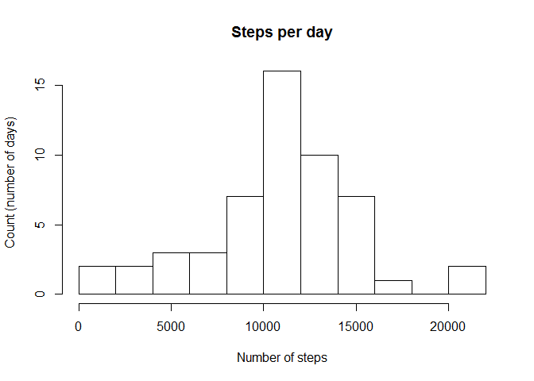
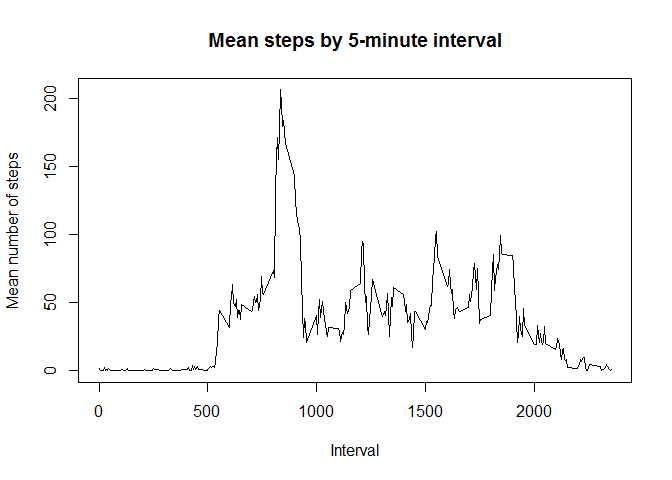
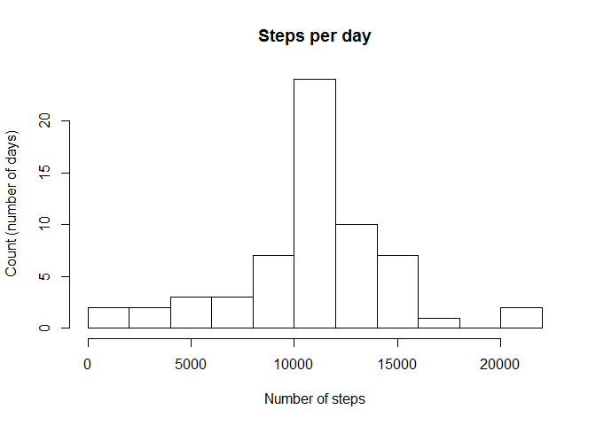
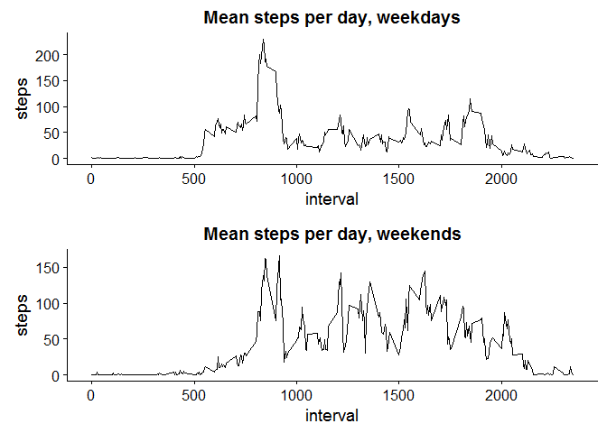

# Reproducible Research: Peer Assessment 1


## Loading and preprocessing the data
This code assumes that the data file (activity.csv) is unzipped and in a folder called activity and that the activity folder is in the same folder as the markdown file.

```r
activity<-read.csv('activity\\activity.csv')
# Make sure that the dates in the file are correctly encoded as such
activity$date<-as.Date(activity$date)
```

## What is mean total number of steps taken per day?

First, calculate the total number of steps per day:

```r
stepsPerDay<- aggregate(list(steps=activity$steps), list(date=activity$date), sum)
```

Next, create a histogram of the total number of steps per day:

```r
hist(stepsPerDay$steps, breaks = 15, xlab = "Number of steps", ylab = "Count (number of days)", main = "Steps per day")
```

<!-- -->

Then calculate the mean of the steps, to get the mean total number of steps taken per day, removing NAs:

```r
mean(stepsPerDay$steps, na.rm = TRUE)
```

```
## [1] 10766.19
```

Do the same for median:

```r
median(stepsPerDay$steps, na.rm = TRUE)
```

```
## [1] 10765
```

## What is the average daily activity pattern?
First, calculate the mean across 5-minute intervals, removing NAs:

```r
meanStepsPerInterval<- aggregate(list(steps=activity$steps), list(interval=activity$interval), mean, na.rm=TRUE, na.action=NULL)
```

Then, create the time series plot of the average (mean) number of steps taken per interval:

```r
plot(meanStepsPerInterval$interval, meanStepsPerInterval$steps, type = "l", xlab = "Interval", ylab = "Mean number of steps", main = "Mean steps by 5-minute interval")
```

<!-- -->

Next, calculate the time interval which, on average, has the highest number of steps:

```r
meanStepsPerInterval[which.max(meanStepsPerInterval$steps),1]
```

```
## [1] 835
```

## Imputing missing values
First, calculate the number of intervals that are missing data (the total number of rows with NAs):

```r
sum(is.na(activity$steps))
```

```
## [1] 2304
```

Next, replace the missing values with the mean of the number of steps for that time interval, across all days:

```r
# First, copy the data into a new dataframe
noNAsActivity<-activity
# Then, find the intervals which are missing data
missingDataIndices<- which(is.na(noNAsActivity$steps))
# To find the data to use to replace the NAs, we need to know what interval each NA was a part of (since I chose to use the mean steps for that interval, the day doesn't matter, just the interval)
missingDataIntervals<-noNAsActivity[missingDataIndices,3]
# Now, use those indicies to look up the matching mean, calculated earlier.
dataToReplace<-meanStepsPerInterval$steps[match(missingDataIntervals, meanStepsPerInterval$interval)]
# Last, place this data back into the new dataframe, using the missing indicies only (to insure only the NAs are replace, and with the correct data)
noNAsActivity[missingDataIndices,1]<-dataToReplace
```
Now, make the same histogram as in the first part fo the assignment and recalculate the mean and median, but use the data with the NAs interpolated.
First, calculate the total number of steps per day:

```r
stepsPerDay<- aggregate(list(steps=noNAsActivity$steps), list(date=noNAsActivity$date), sum)
```

Next, create a histogram of the total number of steps per day:

```r
hist(stepsPerDay$steps, breaks = 15, xlab = "Number of steps", ylab = "Count (number of days)", main = "Steps per day")
```

<!-- -->


Then calculate the mean of the steps, to get the mean total number of steps taken per day, removing NAs:

```r
mean(stepsPerDay$steps, na.rm = TRUE)
```

```
## [1] 10766.19
```

Do the same for median:

```r
median(stepsPerDay$steps, na.rm = TRUE)
```

```
## [1] 10766.19
```
As you can see, replacing the data with an interpolated value (in this case, the mean for that interval across all days), had very little effect on the historgram and the median. The mean is exactly the same, as you would expect, as we replaced each missing value with the mean (which doesn't shift the mean at all).

## Are there differences in activity patterns between weekdays and weekends?
First, add the new variable for weekend/weekday and make sure it is a factor

```r
noNAsActivity$typeOfDay<-as.factor(ifelse(weekdays(noNAsActivity$date) %in% c("Saturday", "Sunday"),"weekend","weekday"))
```
Now, subset the data 
Next, calculate the mean across 5-minute intervals, for both weekdays and weekends:

```r
weekdayOnly=noNAsActivity[which(noNAsActivity$typeOfDay=="weekday"),1:3]
meanStepsPerIntervalWeekdays<- aggregate(list(steps=weekdayOnly$steps), list(interval=weekdayOnly$interval), mean, na.rm=TRUE, na.action=NULL)

weekendOnly=noNAsActivity[which(noNAsActivity$typeOfDay=="weekend"),1:3]
meanStepsPerIntervalWeekends<- aggregate(list(steps=weekendOnly$steps), list(interval=weekendOnly$interval), mean, na.rm=TRUE, na.action=NULL)
```
Load packages needed for the plot (warnings are suppressed)

```r
# Load the ggplot2, gridExtra and cowplot library
library(ggplot2)
library("gridExtra")
library("cowplot")
```

```
## 
## Attaching package: 'cowplot'
```

```
## The following object is masked from 'package:ggplot2':
## 
##     ggsave
```
Then, create the time series plot of the average (mean) number of steps taken per interval. separated by weekdays and weekends:

```r
p1 <- ggplot(data=meanStepsPerIntervalWeekdays, aes(x=interval, y=steps)) + ggtitle("Mean steps per day, weekdays") +geom_line(stat="identity")

p2 <- ggplot(data=meanStepsPerIntervalWeekends, aes(x=interval, y=steps)) + ggtitle("Mean steps per day, weekends") +geom_line(stat="identity")

grid.arrange(p1, p2, ncol=1, nrow =2)
```

<!-- -->
